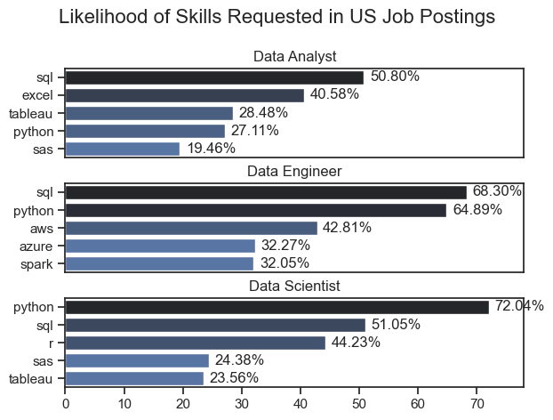
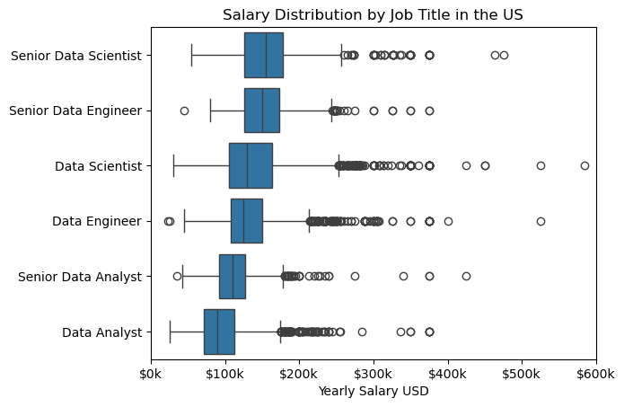
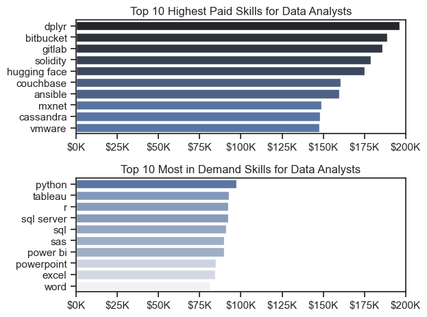
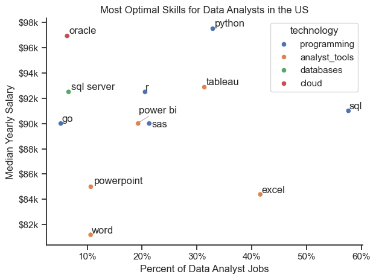

# Overview

This analysis of the data job market was done using a guided youtube video by Luke Barousse. The focus of this project was to get a concrete understanding on basic python coding concepts. The project dives into top paying and in demand skills to help find optimal job opportunities for data analysts using a live dataset.

# The Questions

Below are the questions that will be answered with this project:

1. What are the skills most in demand for the top 3 most popular data roles?
2. How are in-demand skills trending for Data Analysts?
3. How well do jobs and skills pay for Data Analysts?
4. What are the optimal skills for data analysts to learn? (High Demand & High Pay)

# Tools Used

- Python: backbone of the analysis
    - Pandas Library: used to analyze the data
    - Matplotlib Library: used to visualize data
    - Seaborn Library: used for advanced customization of visualized data
- Jupyter Notebooks: tool used to run / organise and annotate python scripts
- Visual Studio Code: hosted python & jupyter notebooks
- Git & Github: version control & sharing


# The Analysis

## 1. What are the most demanded skills for the top 3 most popular data roles?

To find the most demanded skills for the top 3 most popular data roles, I filtered out those positions popularity, and got the top 5 skills for these top 3 roles. This query highlights the most popular job titles and their top skills, showing which skills I should pay attention to depending on the role.

View my notebook with detailed steps here: [3_Project/2_Skill_Demand.ipynb](2_Skill_Demand.ipynb)


### Visualise the Data
```python
fig, ax = plt.subplots(len(job_titles), 1)
sns.set_theme(style = "ticks")
for i, job_title in enumerate(job_titles):
    df_plot = df_skills_perc[df_skills_perc['job_title_short'] == job_title].head(5)
    #df_plot.plot(kind='barh', x='job_skills', y='skill_percent', ax=ax[i], title=job_title)
    sns.barplot(data=df_plot, x='skill_percent', y='job_skills', ax=ax[i], hue='skill_count', palette='dark:b_r')
    ax[i].set_ylabel('')
    ax[i].legend().set_visible(False)
    ax[i].set_xlabel('skill percent')
    ax[i].set_xbound(0, 78)

    for n, v in enumerate(df_plot['skill_percent']):
        ax[i].text(v + 1, n, f'{v:.2f}%', va='center')

    if i != len(job_titles) -1:
        ax[i].set_xticks([])
fig.suptitle('Likelihood of Skills Requested in US Job Postings', fontsize=16)
fig.tight_layout(h_pad=0.5)
plt.show()
```

### Results


### Insights
- Python is a versatile skill, with high demand across all 3 roles, but mostly prominent for Data Scientists (~72%) and Data Engineers (~65%).
- SQL is the most requested skill for Data Analysts and Data Scientists, with over half of the job postings for both roles. For Data Engineers, SQL is the most sought after skill, apearing in ~68% of job postings.
- Data Engineers require more specialized technical skills compared to Data Analysts and Data Scientists, such as aws, azure, and spark.

## 2. How are in-demand skills trending for Data Analysts?

To find trends over time, pivot tables were used to aggregate the data across months and counts of skills observed. This pivot table was then graphed to visualise the top 5 skills trends over time.

### Visualise the Data
```python
df_plot = df_DA_US_percent.iloc[:, :5]

sns.lineplot(data=df_plot, dashes=False, palette='tab10')
sns.set_theme(style='ticks')
plt.title('Trending Top Skills for Data Analysts in the US')
plt.ylabel('Likelihood in Job Posting')
plt.xlabel('2023')
plt.legend().remove()
sns.despine()

from matplotlib.ticker import PercentFormatter
ax = plt.gca()
ax.yaxis.set_major_formatter(PercentFormatter(decimals=0))
for i in range(5):
    plt.text(11.2, df_plot.iloc[-1, i], df_plot.columns[i])
```

### Results


Bar graph visualizing the trending top skills for data analysts in the US in 2023.

### Insights:

- SQL remains the most demanded skill across months, but shows a gradual decrease.
- Excel remained the second most sought after skill, showing an increase around June but an overall decrease across the year.
- Python, tableau, and power bi remained relatively stable in terms of demand. Python showed a slight uptrend towards the end of the year.

## 3. How well do jobs and skills pay for Data Analytics?

### Salary Analysis for Data Jobs

In order to compare salaries between roles, the top 6 most popular roles were filtered for and sorted by median salaries, then plotted using box plots.

#### Visualize Data
```python
sns.boxplot(data=df_US_top6, x='salary_year_avg', y='job_title_short', order=job_order)
plt.title('Salary Distribution by Job Title in the US')
plt.xlabel('Yearly Salary USD')
ax = plt.gca()
ax.xaxis.set_major_formatter(plt.FuncFormatter(lambda x, post: f'${int(x/1000)}k'))
plt.xlim(0, 600000)
plt.ylabel('')
plt.show()
```

#### Results


*Boxplots of top 6 roles*

### Insights:

- There is a significant variation in salary ranges across different job titles. Senior Data Scientist positions tend ot have the highest salary potential, indicating the value placed on advanced data skills relevant to this role.

-  Data Engineer, Senior Data Scientist, and  Data Scientist roles show a considerable number of outliers on the higher end of the salary spectrum, suggesting that some rare circumstances in these roles can lead to high pay. 

- Senior Data Analysts get less than Data Scientists and Data Engineers.

### Highest paid & Most Demanded Skills for Data Analysts

In order to compare the most demanded skills to the highest paying skills, two dataframes were created that sorted by top count and top median salary of job skills for Data Analysts in the US. These two dataframes were then compared using the top 10 paying skills from each using a horizontal bar chart.

#### Visualize the Data
```python
fig, ax = plt.subplots(2, 1)

#df_DA_top_pay[::-1].plot(kind='barh', y='median', ax=ax[0], legend=False)
sns.barplot(data=df_DA_top_pay, x='median', y=df_DA_top_pay.index, ax=ax[0], hue='median', palette='dark:b_r')
ax[0].set_title('Top 10 Highest Paid Skills for Data Analysts')
ax[0].set_ylabel('')
ax[0].set_xlabel('')
ax[0].xaxis.set_major_formatter(plt.FuncFormatter(lambda x, _: f'${int(x/1000)}K'))
ax[0].legend().remove()

#df_DA_skills[::-1].plot(kind='barh', y='median', ax=ax[1], legend=False)
sns.barplot(data=df_DA_skills, x='median', y=df_DA_skills.index, ax=ax[1], hue='median', palette='light:b')
ax[1].set_title('Top 10 Most in Demand Skills for Data Analysts')
ax[1].set_ylabel('')
ax[1].set_xlabel('')
ax[1].xaxis.set_major_formatter(plt.FuncFormatter(lambda x, _: f'${int(x/1000)}K'))
ax[1].legend().remove()

ax[0].set_xlim(0, 200000)
ax[1].set_xlim(0, 200000)

sns.set_theme(style='ticks')

plt.tight_layout()
plt.show()
```

#### Results



*Two seperate bar graphs visualizing the highest paid skills and most in-demand skills for data analysts in the US.*

#### Insights

- The top graph shows specialized technical skills associated with higher salaries. It is important to note that the count of these top skills was very low in the dataset.

- The bottom graph highlights foundational skills that are most in demand, but they do not offer high median salaries like the top skills. 

- There's a clear distinction between the skills that are highest paid and those that are in-demand. Data analysts aiming to maximize their career potential should consider developing a diverse skill set.

## 4. What is the most optimal skill to learn for Data Analysts?

In order to compare the % likelihood of a skill showing up in a job posting and the median salary of the skill, a dataframe was created that compared top median salaries and % likelihoods of a skill being in a job listing. Skills above 5% were kept for the graph.

#### Visualize Data
```python

sns.scatterplot(
    data=df_plot,
    x='skill_percent',
    y='median_salary',
    hue='technology')
plt.xlabel('Percent of Data Analyst Jobs')
plt.ylabel('Median Yearly Salary')
plt.title('Most Optimal Skills for Data Analysts in the US')
sns.despine()
sns.set_theme(style='ticks')
texts = []
for i, txt in enumerate(df_DA_skills_high_demand.index):
    if txt == "power bi":
        texts.append(plt.text(df_DA_skills_high_demand['skill_percent'].iloc[i], y+50, txt))
    else: 
        texts.append(plt.text(df_DA_skills_high_demand['skill_percent'].iloc[i], df_DA_skills_high_demand['median_salary'].iloc[i], txt))

adjust_text(texts, arrowprops=dict(arrowstyle='->', color='gray', lw=.5))

ax = plt.gca()
ax.yaxis.set_major_formatter(plt.FuncFormatter(lambda y, pos: f'${int(y/1000)}k'))
                             


from matplotlib.ticker import PercentFormatter
ax.xaxis.set_major_formatter(PercentFormatter(decimals=0))
plt.tight_layout()
plt.show()
```

#### Results



*A scatter plot visualizing the most optimal skills (high paying & high demand) for data analysts in the US.*

#### Insights:

- The scatter plot shows that programming skills tend to clustercluster at higher salary levels compared to analyst tools within the data analytics field

- Analyst tools are prevelant in job postings, with tableau having the highest salary.

- The database and cloud skills offer high competitive salaries, but are less prevelant than programming and analyst tools. 
